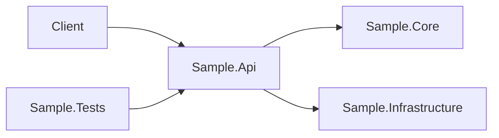

# Mermaid Cheatsheet

Prefer `flowchart` for solution and dependency views.

## Example

## Notes
- Keep project names close to the actual `.csproj` names.
- Use left-to-right flow for dependency diagrams.
- Explain omitted runtime infrastructure in prose when necessary.