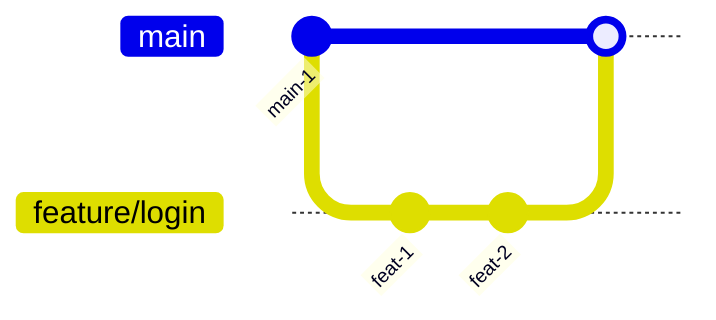
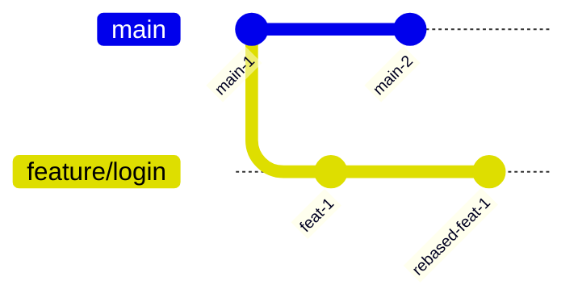

# Mermaid Cheatsheet

Prefer `gitGraph` for branching workflows.

## Merge example

## Rebase example

## Notes
- Use concrete branch names.
- Mention in prose when the branch is published to `origin`.
- Explain rebase separately because `gitGraph` does not fully express force-push semantics.
