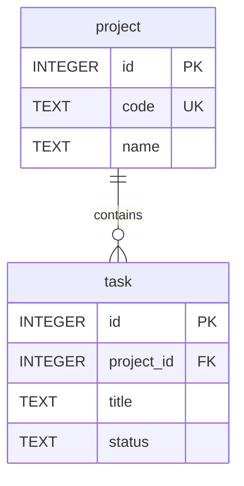

# Mermaid Cheatsheet

Prefer `erDiagram` for SQLite schemas.

## Example

## Notes
- Keep attribute lists short enough to remain readable.
- Use `PK`, `FK`, and `UK` markers when they improve clarity.
- Explain extra constraints in prose if the diagram would become noisy.