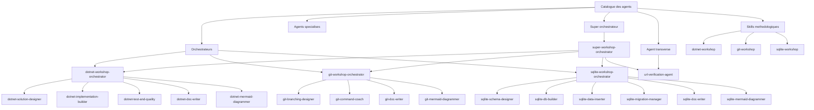
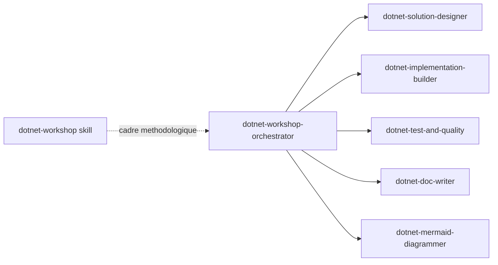
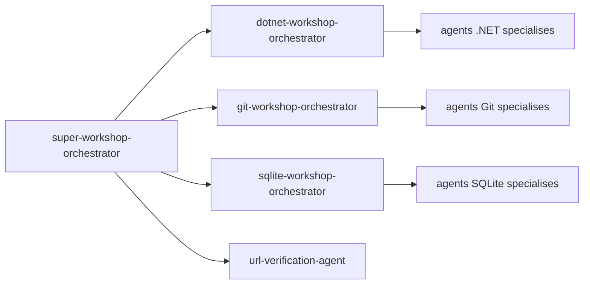
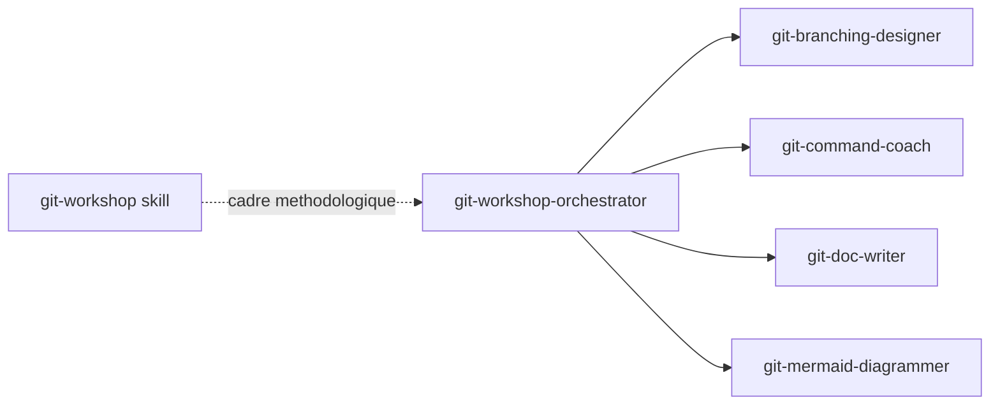
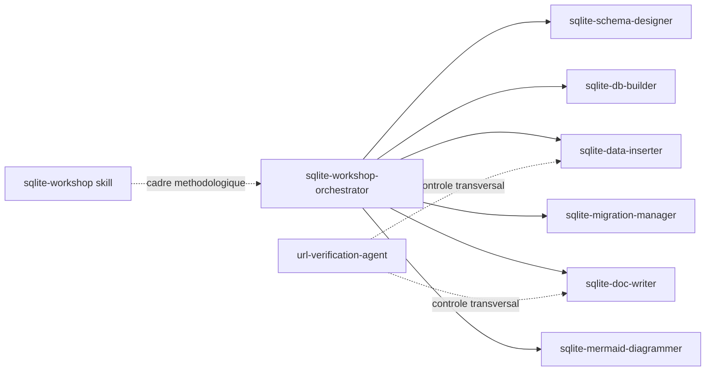

# Dependances et arbres des agents

Ce document explique comment les agents se relient entre eux.

Pour un public fonctionnel, il faut lire le mot `dependance` comme une relation de travail:
- qui pilote ;
- qui execute une tache specialisee ;
- quel guide methodologique est applique en soutien.

## 1. Vue globale



## 2. Arbre logique du depot

```text
.github/
  agents/
    super-workshop-orchestrator.agent.md
    dotnet-workshop-orchestrator.agent.md
    dotnet-solution-designer.agent.md
    dotnet-implementation-builder.agent.md
    dotnet-test-and-quality.agent.md
    dotnet-doc-writer.agent.md
    dotnet-mermaid-diagrammer.agent.md
    git-workshop-orchestrator.agent.md
    git-branching-designer.agent.md
    git-command-coach.agent.md
    git-doc-writer.agent.md
    git-mermaid-diagrammer.agent.md
    sqlite-workshop-orchestrator.agent.md
    sqlite-schema-designer.agent.md
    sqlite-db-builder.agent.md
    sqlite-data-inserter.agent.md
    sqlite-migration-manager.agent.md
    sqlite-doc-writer.agent.md
    sqlite-mermaid-diagrammer.agent.md
    url-verification-agent.agent.md
  skills/
    dotnet-workshop/
      SKILL.md
    git-workshop/
      SKILL.md
    sqlite-workshop/
      SKILL.md
```

## 3. Arbre fonctionnel par famille

### Super orchestration transverse
```text
super-workshop-orchestrator
  -> dotnet-workshop-orchestrator
  -> git-workshop-orchestrator
  -> sqlite-workshop-orchestrator
  -> url-verification-agent
  -> peut deleguer directement a des specialistes si la demande est tres ciblee
```

### Famille .NET
```text
dotnet-workshop-orchestrator
  -> dotnet-solution-designer
  -> dotnet-implementation-builder
  -> dotnet-test-and-quality
  -> dotnet-doc-writer
  -> dotnet-mermaid-diagrammer
  -> support methodologique: dotnet-workshop
```

### Famille Git
```text
git-workshop-orchestrator
  -> git-branching-designer
  -> git-command-coach
  -> git-doc-writer
  -> git-mermaid-diagrammer
  -> support methodologique: git-workshop
```

### Famille SQLite
```text
sqlite-workshop-orchestrator
  -> sqlite-schema-designer
  -> sqlite-db-builder
  -> sqlite-data-inserter
  -> sqlite-migration-manager
  -> sqlite-doc-writer
  -> sqlite-mermaid-diagrammer
  -> support methodologique: sqlite-workshop
```

### Agent transverse
```text
url-verification-agent
  -> peut etre appele directement par le super-workshop-orchestrator
  -> peut etre mobilise en appui d'un travail SQLite ou documentaire
```

## 4. Graphes de dependance par famille

### Graphe .NET


### Graphe de super orchestration


### Graphe Git


### Graphe SQLite


## 5. Explication des dependances

## Niveau 1: dependances d'orchestration
- Le `super-workshop-orchestrator` constitue le niveau de pilotage le plus haut.
- Les trois orchestrateurs de famille portent ensuite une logique de delegation vers plusieurs sous-agents specialises.
- Cette dependance signifie qu'ils selectionnent un ou plusieurs specialistes selon la nature de la demande.
- Pour un acteur fonctionnel, cela revient a dire qu'un chef d'orchestre principal peut mobiliser des chefs d'orchestre de domaine, puis les experts adaptes.

## Niveau 2: dependances de specialisation
- Les agents specialises n'ont pas vocation a piloter la totalite d'un sujet.
- Ils interviennent sur une partie precise de la chaine de valeur: conception, implementation, qualite, documentation, diagramme, migration, etc.
- Leur dependance a l'orchestrateur est une dependance de coordination, pas une dependance technique forte.

## Niveau 3: dependances methodologiques
- Les skills `dotnet-workshop`, `git-workshop` et `sqlite-workshop` ne sont pas des executants.
- Ils servent de referentiel commun: workflow, ordre logique des etapes, references et conventions.
- Pour un public fonctionnel, ils jouent le role de mode operatoire standardise.

## Niveau 4: dependance transverse de verification
- `url-verification-agent` est autonome.
- Il peut etre mobilise directement par le `super-workshop-orchestrator`, ou venir completer utilement un travail documentaire ou un catalogue de donnees.
- Sa valeur fonctionnelle est de fournir un controle final de coherence externe.

## 6. Lecture par parcours metier

### Parcours A: faire naitre une solution .NET
```text
Besoin metier
  -> super-workshop-orchestrator
    -> dotnet-workshop-orchestrator
    -> design de solution
    -> implementation
    -> qualite et tests
    -> documentation
    -> diagrammes
```

### Parcours B: formaliser une pratique Git
```text
Besoin d'organisation Git
  -> super-workshop-orchestrator
    -> git-workshop-orchestrator
    -> modele de branches
    -> commandes
    -> documentation
    -> schema visuel
```

### Parcours C: construire ou faire evoluer une base SQLite
```text
Besoin donnees
  -> super-workshop-orchestrator
    -> sqlite-workshop-orchestrator
    -> schema
    -> scripts de creation
    -> donnees d'exemple
    -> migrations
    -> documentation
    -> diagrammes ER
    -> verification optionnelle d'URL
```

## 7. Synthese pour les acteurs fonctionnels
- Le `super-workshop-orchestrator` est le point d'entree unique le plus large.
- Les orchestrateurs de famille sont les points d'entree de domaine.
- Les agents specialises produisent les livrables concrets.
- Les skills garantissent une methode stable et repetable.
- Les graphes montrent la chaine de responsabilite.
- Les arbres montrent la structure et l'organisation du catalogue.
