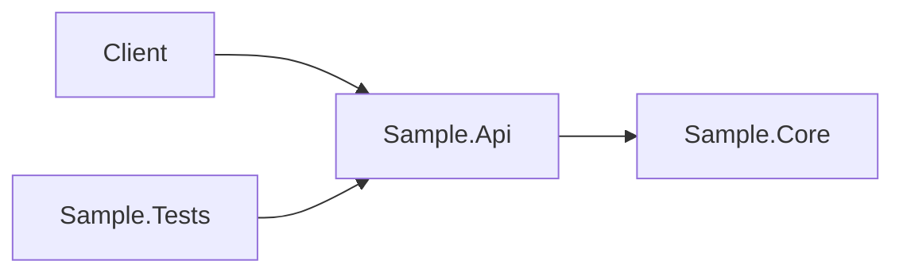

# Dotnet Workshop

Ce workshop montre comment decomposer un sujet .NET en plusieurs agents specialises.

## Parcours principal
1. Definir le type d'application .NET.
2. Concevoir la structure de solution ou de projet.
3. Produire les fichiers C# et `.csproj`.
4. Definir les commandes de build, run et test.
5. Documenter l'architecture en Markdown.
6. Produire un schema Mermaid de l'architecture.

## Exemple de creation d'un projet console
```bash
dotnet new console -n SampleApp
dotnet build SampleApp
dotnet run --project SampleApp
```

## Exemple de structure multi-projet
```text
SampleSolution/
  Sample.Api/
  Sample.Core/
  Sample.Tests/
```

## Exemple de diagramme Mermaid


## Validation minimale
```bash
dotnet build
dotnet test
```