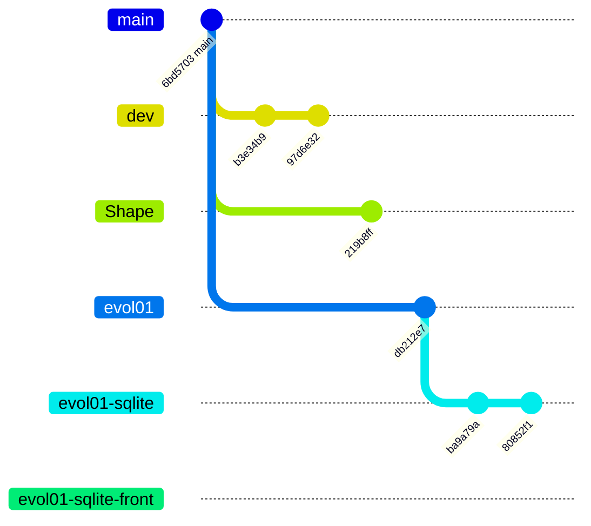

# Schema des branches Git

Ce document decrit l'etat actuel des branches locales et distantes du depot.

## Branches observees
- `main`
- `dev`
- `evol01`
- `evol01-sqlite`
- `evol01-sqlite-front`
- `origin/main`
- `origin/dev`
- `origin/evol01`
- `origin/evol01-sqlite`
- `origin/evol01-sqlite-front`
- `origin/Shape`

## Diagramme Mermaid

## Lecture rapide
- `main` est la branche racine du depot.
- `dev` diverge directement de `main`.
- `Shape` diverge aussi directement de `main`.
- `evol01` diverge de `main`.
- `evol01-sqlite` diverge de `evol01`.
- `evol01-sqlite-front` diverge de `evol01-sqlite` mais pointe actuellement sur le meme HEAD `80852f1`.
- `evol01-sqlite-front` est la branche courante.

## Etat local et distant
- `main` est alignee avec `origin/main`.
- `dev` est alignee avec `origin/dev`.
- `evol01` est alignee avec `origin/evol01`.
- `evol01-sqlite` est alignee avec `origin/evol01-sqlite`.
- `evol01-sqlite-front` est alignee avec `origin/evol01-sqlite-front`.

## HEAD observes
- `main` pointe sur `6bd57037f7be683f62f6dd3ebfe4e6436599bb92`.
- `dev` pointe sur `97d6e320cb66efefd4e06e36e81aa6f374403b46`.
- `evol01` pointe sur `db212e70112fdacc5c502e16bd74c2134bcedede`.
- `evol01-sqlite` pointe sur `80852f1569334449a1c6aa143b7b7cc02ffcdd91`.
- `evol01-sqlite-front` pointe sur `80852f1569334449a1c6aa143b7b7cc02ffcdd91`.