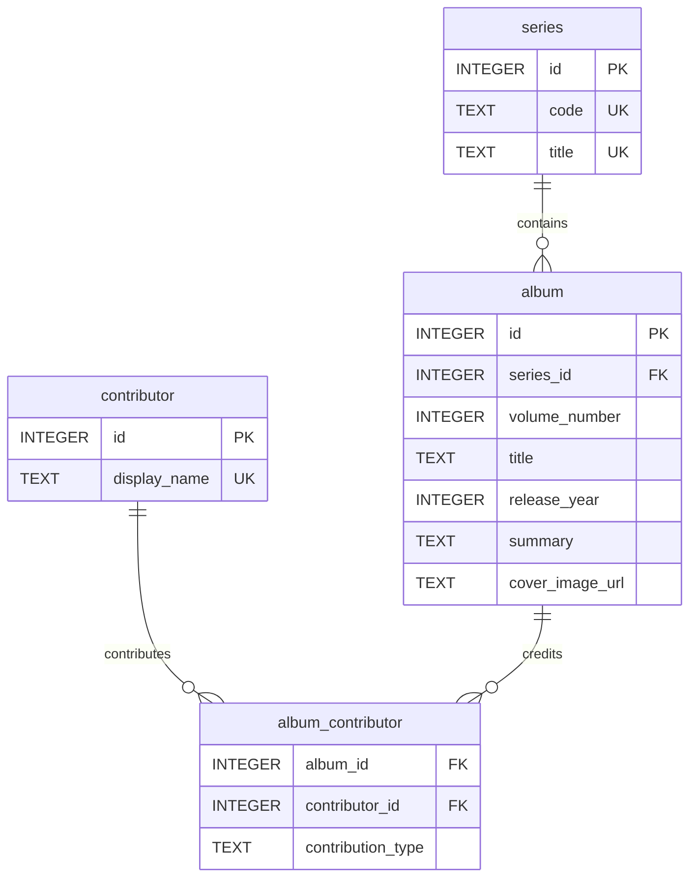

# Base SQLite de catalogue BD

Cette base couvre un catalogue d'albums centre sur `Les Chroniques de la Lune Noire`.

Le modele a ete adapte pour integrer directement les elements du jeu de donnees : numero de volume, titre, annee, auteur de dessin, resume et visuel.

## Tables principales
- `series`: reference la saga ou collection.
- `contributor`: reference les dessinateurs.
- `album`: stocke les volumes avec leur numero, annee, resume et visuel.
- `album_contributor`: gere l'association entre album et contributeur, ici avec le role `dessin`.

## Flux de construction
1. Appliquer les migrations dans `examples/library-management/migrations/` dans l'ordre numerique.
2. Appliquer `examples/library-management/seed.sql` pour inserer un jeu de donnees minimal.
3. Ou bien generer directement `data/library.sqlite` avec le builder .NET fourni dans `tools/library-db-builder`.

## Exemple de seed
```sql
INSERT INTO album (id, series_id, volume_number, title, release_year, summary, cover_image_url)
VALUES (1, 1, 0, 'En un jeu cruel', 2011, 'Origines de Wismerhill et du jeu infernal', 'https://www.dargaud.com/sites/default/files/styles/album/public/album/9782205069236_001.jpg');
```

## Exemple de migration
```sql
CREATE TABLE IF NOT EXISTS album (
    id INTEGER PRIMARY KEY,
    series_id INTEGER NOT NULL,
    volume_number INTEGER NOT NULL,
    title TEXT NOT NULL,
    release_year INTEGER NOT NULL,
    summary TEXT NOT NULL,
    cover_image_url TEXT NOT NULL UNIQUE,
    UNIQUE (series_id, volume_number)
);
```

## Diagramme Mermaid ER


## Limitation de l'environnement
Le depot contient les artefacts SQL, la documentation Markdown et le schema Mermaid. La base peut etre generee dans `data/library.sqlite` avec le builder .NET du depot.