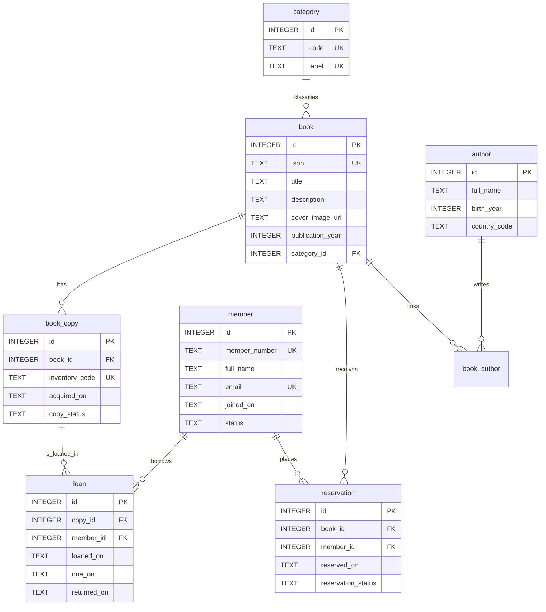

# Base SQLite de gestion de bibliotheque

Cette base couvre la gestion des livres, auteurs, adherents, exemplaires, emprunts et reservations.

Les livres exposent aussi un champ `description` et un champ `cover_image_url` pour permettre l'affichage detaille des ouvrages dans une interface.

## Tables principales
- `author`: reference les auteurs.
- `category`: classe les livres par categorie.
- `member`: stocke les adherents de la bibliotheque.
- `book`: decrit les ouvrages.
- `book_author`: gere la relation plusieurs-a-plusieurs entre livres et auteurs.
- `book_copy`: represente les exemplaires physiques disponibles au pret.
- `loan`: suit les emprunts des exemplaires.
- `reservation`: suit les reservations par ouvrage.

## Flux de construction
1. Appliquer les migrations dans `examples/library-management/migrations/` dans l'ordre numerique.
2. Appliquer `examples/library-management/seed.sql` pour inserer un jeu de donnees minimal.
3. Ou bien generer directement `data/library.sqlite` avec le builder .NET fourni dans `tools/library-db-builder`.

## Exemple de seed
```sql
INSERT INTO member (id, member_number, full_name, email, joined_on, phone, status)
VALUES (1, 'MBR-001', 'Alice Martin', 'alice.martin@example.org', '2026-01-15', '+33140000001', 'active');
```

## Exemple de migration
```sql
ALTER TABLE member ADD COLUMN phone TEXT;
```

## Exemple de presentation de livre
```sql
ALTER TABLE book ADD COLUMN description TEXT;
ALTER TABLE book ADD COLUMN cover_image_url TEXT;
```

## Diagramme Mermaid ER


## Limitation de l'environnement
Le depot contient les artefacts SQL, la documentation Markdown et le schema Mermaid. La base peut etre generee dans `data/library.sqlite` avec le builder .NET du depot.