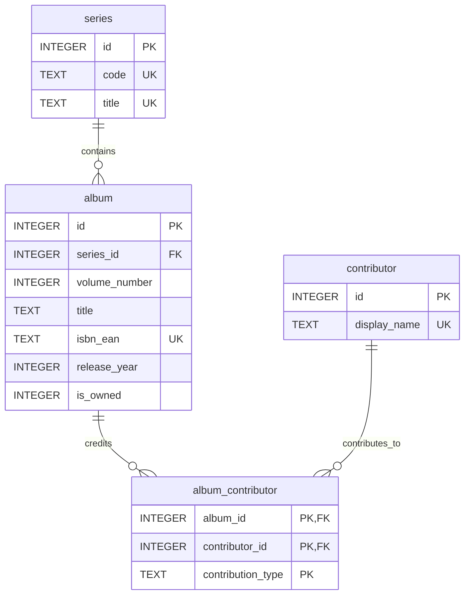

# Base SQLite du catalogue BD

## Contexte
Cette base SQLite alimente un catalogue de bandes dessinees centre sur l'univers BlackMoon, avec un jeu de donnees qui couvre d'abord Les Chroniques de la Lune Noire puis s'etend a d'autres series de fantasy comme Elric et Hawkmoon.

Le coeur metier est le catalogue d'albums :
- une serie regroupe plusieurs albums ;
- un album porte ses metadonnees editoriales, ses liens de reference et son statut de possession ;
- un contributeur peut intervenir sur plusieurs albums ;
- la table d'association `album_contributor` conserve les credits, ici principalement pour le dessin.

La possession d'un album est persistee dans la colonne `is_owned` de la table `album`. Cette colonne est ajoutee par la migration `008_add_album_owned_flag.sql` avec la valeur par defaut `0`.

## Vue d'ensemble du schema
Le schema relationnel final repose sur quatre tables :
- `series` : la saga ou collection, identifiee par un code unique et un titre unique ;
- `album` : le volume catalogue, rattache a une serie ;
- `contributor` : le dessinateur ou autre intervenant credite ;
- `album_contributor` : la table de jointure entre `album` et `contributor`.

Relations :
- une serie contient zero a plusieurs albums ;
- un album appartient a une seule serie ;
- un album peut avoir zero a plusieurs contributeurs ;
- un contributeur peut etre reference sur zero a plusieurs albums.

Contraintes principales :
- `series.code` est unique ;
- `series.title` est unique ;
- `album.isbn_ean` est unique ;
- `album.dargaud_url` est unique ;
- `album.cover_image_url` est unique ;
- le couple `album.(series_id, volume_number)` est unique ;
- la cle primaire de `album_contributor` est composee de `album_id`, `contributor_id` et `contribution_type`.

Extrait SQL pour la persistance du statut de possession :

```sql
ALTER TABLE album ADD COLUMN is_owned INTEGER NOT NULL DEFAULT 0;
```

## Reference des tables

### series
| Colonne | Type | Role |
| --- | --- | --- |
| id | INTEGER | Cle primaire |
| code | TEXT | Code metier unique de la serie |
| title | TEXT | Titre unique de la serie |

### contributor
| Colonne | Type | Role |
| --- | --- | --- |
| id | INTEGER | Cle primaire |
| display_name | TEXT | Nom affiche du contributeur, unique |

### album
| Colonne | Type | Role |
| --- | --- | --- |
| id | INTEGER | Cle primaire |
| series_id | INTEGER | Reference vers `series.id` |
| volume_number | INTEGER | Numero du tome dans la serie |
| title | TEXT | Titre de l'album |
| dargaud_publication_date | TEXT | Date editoriale conservee telle quelle |
| scenario | TEXT | Auteur ou scenariste affiche |
| drawing | TEXT | Dessinateur tel qu'affiche dans la source |
| isbn_ean | TEXT | Identifiant commercial unique |
| release_year | INTEGER | Annee de parution |
| summary | TEXT | Resume catalogue |
| dargaud_url | TEXT | URL de la fiche editeur |
| cover_image_url | TEXT | URL de la couverture |
| summary_source_url | TEXT | URL source du resume |
| is_owned | INTEGER | Flag de possession, `0` ou `1` |

### album_contributor
| Colonne | Type | Role |
| --- | --- | --- |
| album_id | INTEGER | Reference vers `album.id` |
| contributor_id | INTEGER | Reference vers `contributor.id` |
| contribution_type | TEXT | Type de contribution, par exemple `dessin` |

## Procedure de build
Le chemin recommande est d'appliquer les migrations dans l'ordre numerique, puis de charger le seed initial si vous construisez une base a partir de zero.

Ordre des migrations :
1. `001_initial_schema.sql` : cree le premier schema catalogue avec `series`, `contributor`, `album` et `album_contributor`.
2. `002_add_member_phone.sql` : migration reservee, conservee pour la continuite du workshop.
3. `003_add_book_presentation.sql` : migration reservee, conservee pour la continuite du workshop.
4. `004_adapt_to_comics_catalog.sql` : reconstruit le schema en quittant l'ancien modele de pret pour un catalogue BD.
5. `005_expand_album_metadata.sql` : ajoute les metadonnees editoriales et met a jour les albums existants.
6. `006_enforce_album_metadata_uniqueness.sql` : ajoute les contraintes d'unicite sur `isbn_ean` et `dargaud_url`.
7. `007_add_glenat_series.sql` : ajoute les series Elric et Hawkmoon, leurs contributeurs et leurs albums.
8. `008_add_album_owned_flag.sql` : ajoute `album.is_owned` avec `DEFAULT 0` pour persister la possession.

Build manuel type :
- appliquer `001` a `008` dans l'ordre ;
- appliquer ensuite `seed.sql` pour inserer le catalogue initial des Chroniques de la Lune Noire ;
- ou generer directement la base avec les scripts PowerShell et le builder .NET fournis dans le depot.

Points d'attention :
- les migrations ordonnees sont la source d'evolution du schema runtime ;
- le seed charge le premier bloc de donnees BlackMoon ;
- la migration `007` etend ensuite le catalogue a d'autres series fantasy ;
- la migration `008` permet au front et aux services gRPC de conserver l'etat possede ou manquant.

## Diagramme Mermaid ER


## Checklist de revue
- La base finale contient bien les tables `series`, `contributor`, `album` et `album_contributor`.
- La table `album` contient bien la colonne `is_owned`.
- La colonne `is_owned` est non nulle et vaut `0` par defaut.
- Les contraintes d'unicite sur `isbn_ean` et `dargaud_url` sont presentes.
- Les albums restent uniques par couple `series_id` et `volume_number`.
- Les donnees couvrent Les Chroniques de la Lune Noire, Elric et Hawkmoon apres application complete des migrations.