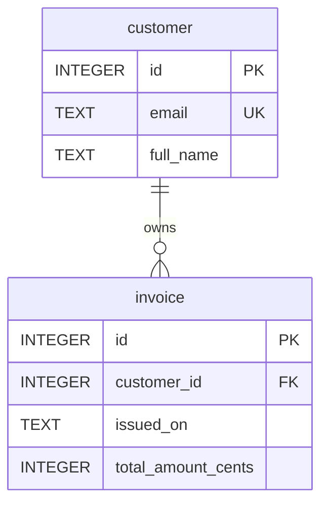

# SQLite Workshop

Ce workshop montre comment decomposer un sujet SQLite en plusieurs agents specialises.

## Parcours principal
1. Definir le domaine et les entites.
2. Concevoir le schema relationnel.
3. Produire un script SQL SQLite.
4. Creer une base `.db` a partir du schema.
5. Inserer des donnees de demonstration.
6. Gerer les migrations de schema ou de donnees.
7. Documenter la base en Markdown.
8. Produire un schema Mermaid de type ER.

## Exemple de schema SQLite
```sql
PRAGMA foreign_keys = ON;

CREATE TABLE IF NOT EXISTS customer (
    id INTEGER PRIMARY KEY,
    email TEXT NOT NULL UNIQUE,
    full_name TEXT NOT NULL
);

CREATE TABLE IF NOT EXISTS invoice (
    id INTEGER PRIMARY KEY,
    customer_id INTEGER NOT NULL,
    issued_on TEXT NOT NULL,
    total_amount_cents INTEGER NOT NULL,
    FOREIGN KEY (customer_id) REFERENCES customer(id)
);

CREATE INDEX IF NOT EXISTS idx_invoice_customer_id ON invoice(customer_id);
```

## Exemple de creation de la base
```bash
sqlite3 billing.db < schema.sql
```

## Exemple d'insertion de donnees
```sql
INSERT INTO customer (id, email, full_name)
VALUES (1, 'alice@example.org', 'Alice Example');
```

## Exemple de migration
```sql
ALTER TABLE customer ADD COLUMN phone TEXT;
```

## Exemple de documentation Markdown
```md
# Billing Database

## Tables
- `customer`: stores customer identity and unique email.
- `invoice`: stores invoices linked to customers.

## Relationships
- One customer can own many invoices.
```

## Diagramme Mermaid ER


Ce diagramme represente une relation un-a-plusieurs entre `customer` et `invoice`, coherente avec la cle etrangere `invoice.customer_id`.

Le workshop SQLite couvre aussi les scripts de seed et les migrations forward-only pour faire evoluer la base sans perdre la trace des changements.